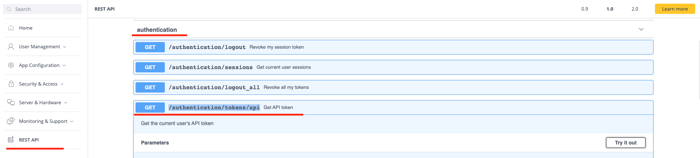

<a name="readme-top"></a>
[![LinkedIn][linkedin-shield]][linkedin-url]
[](https://www.sisense.com)


<!-- PROJECT LOGO -->
<br />
<div align="center">
  <a href="https://www.sisense.com">
    
  </a>
</div>

### Sisense + GPT-3: A new way to supercharge your analytics
This project demonstrates how to bring the power of large scale language models directly into Sisense Fusion by connecting to GPT-3. We will show how to leverage the unique flexible capabilities of Sisense Fusion by building and running Python code from Sisense to phrase dynamic queries to GPT-3, automatically generating new database tables and relationships in Sisense based on the results from GPT-3.


<!-- TABLE OF CONTENTS -->
<details open="open">
  <summary>Table of Contents</summary>
  <ol>
    <li>
      <a href="#about-the-project">About The Project</a>
      <ul>
        <li><a href="#folder-structure">Folder Structure</a></li>
        <li><a href="#built-with">Built With</a></li>
        <li><a href="#prerequisites">Prerequisites</a></li>
        <li><a href="#limitations">Limitations</a></li>
      </ul>
    </li>
    <li>
      <a href="#getting-started">Getting Started</a>
      <ul>
        <li><a href="#installation">Installation</a>
         <ul>
           <li><a href="#installation-for-remote-development">Installation for Remote Development</a>
            <ul>
               <li><a href="#terminal-based-installation">Terminal Based Installation</a></li>
            </ul>
           </li>
           <li><a href="#installation-for-local-development">Installation for Local Development</a></li>  
           <li><a href="#important-tips">Important Tips</a></li>
         </ul>
        </li>
        <li><a href="#extract-authentication-token-from-sisense-rest-api">Extract Authentication Token From Sisense REST API</a></li>       
        <li><a href="#adding-a-new-notebook">Adding a New Notebook</a></li>  
        <li><a href="#configuring-openai's-api-key">Configuring OpenAI's API Key</a></li>
        <li><a href="#triggering-your-notebook">Triggering Your Notebook</a></li>
      </ul>
    </li>
    <li><a href="#usage">Usage</a>
    <ul>
        <li><a href="#developing-integrations">Developing Integrations</a></li>
        <li><a href="#asking-multiple-questions-and-storing-the-results-to-a-table">Asking Multiple Questions and Storing the Results to a Table</a></li>
        <li><a href="#building-a-jaql">Building a JAQL</a></li>      
    </ul>
    </li>
    <li><a href="#general-utilities">General Utilities</a></li>
    <li><a href="#resources">Resources</a></li>
    <li><a href="#contact">Contact</a></li>
  </ol>
</details>
<br/>
<br/>

<!-- ABOUT THE PROJECT -->
## About The Project
This project explains how to leverage Sisense's *Custom Code Transformation* feature together with our extensive API library to connect with generative language models, such as GPT.
You'll find here sample code and documentation on how to enrich data from Sisense with GPT, via your own IDE as a developer experience, as well as a low code experience from the Sisense UI.

### Folder Structure :cactus:
There are two main sections to this project:
1. [Custom Code Notebooks](https://github.com/sisense/ai-integration-examples/tree/main/custom_code_notebooks)    This section showcases sample *Custom Code Transfomration* IPython notebooks of server side code, that holds the logic to handle textual prompts from the client, extract data from sisense via api, enrich data with GPT and write back to sisense. The notebooks are in accordance with the *Custom code Transformation* feature that can be accessed through the Sisense UI.
1. [BloX Examples](https://github.com/sisense/ai-integration-examples/tree/main/blox_examples)    This section holds a full example of *BloX* client side code that is complimentary to the *Custom Code Transformation* ipython notebooks and together create a complete app that passes the user prompt from the *BloX* widget to *Custom Code Transformation*, where data is enriched by GPT and passed back to *BloX*.
<details open="open">
  <summary>Folder Structure</summary>

    ├── images                                         ──> images for docs
    │    
    ├── blox_examples
    │   ├── action snippets 
    │   │   ├── bloxWidgetSummary.json                 ──> BloX action snippet
    │   │   ├── bloxDashboardSummary.json              ──> BloX action snippet
    │   │   ├── bloxDataSearch.json                    ──> BloX action snippet
    │   │   ├── bloxDataConnect.json                   ──> BloX action snippet
    │   │   └── bloxDataSuggest.json                   ──> BloX action snippet
    │   │
    │   ├── images                                     ──> images for BloX widgets
    │   │ 
    │   ├── plugin
    │   │   └── BloxAISummary                          ──> Plugin Code for BloXAISummary
    │   │        └──bloxAI_summary.zip
    │   │ 
    │   └── Readme.md
    │   
    ├── common
    │   ├── BloxAI.dash                                ──> Example dashboard including a BloX widget
    │   └── AITransformation.sdata                     ──> sdata file of an empty ElastiCube required for the Custom Code Transformation
    │
    ├── custom_code_notebooks
    │   ├── DashboardSummary1
    │   │   ├──BloxAIFlows-SummarizeDashboard.png
    │   │   ├──DashboardSummary.sipynb                 ──> Custom Code Transformation example
    │   │   └──DashboardSummary1.ipynb                 ──> Custom Code Transformation import/export file
    │   │      
    │   ├── DataConnect1
    │   │   ├──BloxAIFlows-ConnectRelation.png
    │   │   ├──CreateRelations.sipynb                  ──> Custom Code Transformation example
    │   │   └──DataConnect1.ipynb                      ──> Custom Code Transformation import/export file
    │   │      
    │   ├── DataSearch1
    │   │   ├──BloxAIFlows-DataSearch.png
    │   │   ├──DataSearch.sipynb                       ──> Custom Code Transformation example
    │   │   └──DataSearch1.ipynb                       ──> Custom Code Transformation import/export file
    │   │      
    │   ├── DataSuggest1
    │   │   ├──BloxAIFlows-SuggestRelation.png
    │   │   ├──DataSuggest1.ipynb                      ──> Custom Code Transformation example
    │   │   └──SuggestRelation.sipynb                  ──> Custom Code Transformation import/export file
    │   │      
    │   ├── WidgetSummary1
    │   │   ├──BloxAIFlows-SummarizeWidget.png
    │   │   ├──WidgetSummary.sipynb                    ──> Custom Code Transformation example
    │   │   └──WidgetSummary1.ipynb                    ──> Custom Code Transformation import/export file
    │   │ 
    │   ├── utils
    │   │   ├── AIIntegration.py                       ──> manage the GPT integrations
    │   │   ├── AIQueries.py                           ──> manage the conenction with openAI 
    │   │   ├── AIUtils.py                             ──> utils and shared objects
    │   │   ├── SisenseAPI.py                          ──> Sisense API connection
    │   │   ├── customcode_errors.py                   ──> Python error codes
    │   │   └── InferenceQuestionType.py               ──> Infer question type from the prompts
    │   │ 
    │   ├── __init__.py     
    │   └── Readme.md
    │
    ├── test
    │   └── AIIntegrationTests.ipynb
    │
    ├── InstallBloxAI.ipynb                            ──> ipython notebook with an installer code for the project
    ├── InstallBloxAI.sipynb                           ──> Custom Code notebook that can be imported and help install the project directly through Custom Code Transformation   
    ├── config.json                                    ──> Configuration file for the installer script   
    ├── installer.py                                   ──> Installer script logic   
    ├── installer.sh                                   ──> Installer script executer and wrapper
    ├── requirements.txt
    └── README.md
</details>

### Built With

* Sisense API -      <a href="https://sisense.dev/guides/rest/"></a> 
* Sisense BloX -    <a href="https://docs.sisense.com/main/SisenseLinux/overview-sisense-labs.htm"></a>
* Sisense Custom Code Transformations -     <a href="https://docs.sisense.com/main/SisenseLinux/transforming-query-results-with-python.htm"></a> 
* Python -    [![Python][Python.com]][Python-url]

### Prerequisites
* An active Sisense account and instance
* An Admin role is needed to enable Blox, Custom Code, and Custom Code Transformation features
* Users must be Data Designers to control the model
* Register at OpenAI for your own API key - [OpenAI API key](https://openai.com/blog/openai-api/)
* To use DataSearch, DataSuggest, and DataConnect functionality, a Live model on Snowflake or Redshift is required ("Read" permission sufficient)
* To use DashboardSummary and WidgetSummary, you can use any data model
* Familiarity with [Custom Code Transformations][Custom-Code]

### Limitations
* Supports small scale questions
* GPT-3 has a limitation of 4K characters in the query size
* Questions with a large data size are split to multiple smaller questions

<p align="right">(<a href="#readme-top">back to top</a>)</p>


<!-- GETTING STARTED -->
## Getting Started

### Installation
**Developing** new language model integrations with Sisense can be done in one of the two following ways:
* The "Remote" option - Via the Jupyter server in your Sisense instance.
* The "Local" option – Execution via local IDE.

The default behavior is Remote execution.
To run it locally, the code changes listed below are required. 

#### Installation for Remote Development
This type of installation depends on your deployment type:

* On-prem customers should refer [here](#terminal-based-installation) for a terminal based installation
* Cloud managed customers and on-prem customers who prefer a UI based installation should refer [here](blox_examples/Readme.md#installation) (**Sisense version 23.2 and above**)

##### Terminal Based Installation
1. Log into Sisense and enable Custom-Code, Custom-Code Transformations and Blox as shown [here](blox_examples/Readme.md#installation?plain=1#94)
2. Clone this repository.
3. Edit [the configuration file](config.json).
```json
{
  "mode": "install/uninstall",
  "ip": "X.X.X.X",
  "sisense_port": "30845",
  "user": "ssh user",
  "password": "XXX",
  "sisense_username": "user@sisense.com",
  "sisense_password": "XXX",
  "lm_api_key": "OpenAI API KEY"
}
```
4. Open your terminal and `cd` into the repository's directory.
5. Run the following command: 
```bash
./installer.sh 
```

#### Installation for Local Development <a name="Installation for Local Development"></a>
1. Clone this repository.
2. Install the required libraries using the following command:
```bash
pip install -r requirements.txt
````
Note that you need to uncomment openai library in the requirements file.
3. Extract authentication token from Sisense REST API [explained here](#extracting-the-authentication-token-from-the-sisense-rest-api)
4. Uncomment the code and Insert OpenAI API token [here](custom_code_notebooks/utils/AIQueries.py?plain=1#L30)
5. Change log file destination path to local repo uncomment [here](custom_code_notebooks/utils/AIUtils.py?plain=1#L44), 
   comment [here](custom_code_notebooks/utils/AIUtils.py?plain=1#L42)
6. Set the following environment variables:
`API_GATEWAY_EXTERNAL_SERVICE_HOST={Sisense instance IP}`  
`API_GATEWAY_EXTERNAL_SERVICE_PORT={Sisense instance port}`  
`Cookie={Sisense authentication token}`  
   _(can be done within the notebooks)_

#### Important Tips
1. When executing a notebook, pay attention to the required changes listed in the section [How to run the notebook](custom_code_notebooks/DataSearch1/DataSearch1.ipynb?How_to_run_the_notebook)
2. You can now run the notebooks in the repo or create a new one
3. Creating a new notebook requires additional steps in order for it to be recognised by Sisense, please refer to [Adding a New Notebook](#adding-a-new-notebook)
4. You should also upload the [utils](custom_code_notebooks/utils) files to the server at `http://{Sisense IP}:{Sisense Port}/app/diag/tree/work/storage_notebooks/custom_code_notebooks/notebooks`


### Extracting the Authentication Token from the Sisense REST API <a name="Extracting the Authentication Token from the Sisense REST API"></a>
Using Sisense's API functionality requires an authorization token. You can get a token using an [API call](https://sisense.dev/reference/rest/v1.html?platform=linux&spec=L2022.11#/authentication/login) to `/api/v1/authentication` with your credentials.
You can also call the API via Sisense REST API 

Click **Execute** and extract the token within the response body.

### Adding a New Notebook
In order for your notebook to be recognized by Sisense, you must register it. To do so, a REST API request to create a [notebook](https://sisense.dev/reference/rest/v1.html?platform=linux&spec=L2022.11#/notebooks/createNotebook) is required. The payload of the request should be as follows:
```json
{
    "displayName": "Example",
    "description": "",
    "icon": "",
    "timeout": 0,
    "group": "",
    "additionalParameters": [],
    "isTableDiscoveryEnabled": true,
    "columns": [
        {
            "name": "example",
            "id": "example",
            "type": 2
        }
    ],
    "id": "newNotebook"
}

```
You can now edit this notebook with your code, or simply upload the newly created notebook.

### Configuring OpenAI's API Key <a name="Configuring OpenAI's API Key"></a>
If you are using the [installer](InstallBloxAI.sipynb), follow the installation instructions [here](blox_examples/Readme.md) on how to add your own API key.

If you are using the custom code notebooks directly, you can enter your own OpenAI key [AIQueries.py](custom_code_notebooks/utils/AIQueries.py?plain=1#L32).

<p align="right">(<a href="#readme-top">back to top</a>)</p>


## Triggering Your Notebook <a name="Triggering Your Notebook"></a>
Custom Code transformations are designed to be used after data queries (JAQL calls) and operate on the data returned. The integration with language models does not require a data query as a prior step, but must compile with the existing design. 
For that, you can apply the following steps: 
1. Import the [AITransformation.sdata](common/AITransformation.sdata) into your Sisense system (which is a dummy data model that can be used for queries).
1. Whenever you want to run your notebook, a REST API request to `/datasources/{cubeName}/jaql` is required. This request should include the following payload:
```json
{
        "datasource": { "title": "AITransformation" },
        "metadata": [
            {
                "jaql": {
                    "table": "Empty",
                    "column": "Empty",
                    "dim": "[Empty.Empty]",
                    "filter": { "contains": ""},
                    "datatype": "text",
                    "merged": true,
                    "title": "Empty"
                },
                "instanceid": "00128-E54A-D6",
                "field": {
                    "id": "[Empty.Empty]",
                    "index": 0
                }
            }
        ],
        "count": 1,
        "offset": 0,
        "transformData": [
            {
                "transformDataFormat": {
                    "CustomCodeTransformerFormatType": "Json"
                },
                "customCode": {
                    "codePath": "/work/storage_notebooks/custom_code_notebooks/notebooks/{notebook_directory}/{notebook_name}.ipynb",
                    "cellsDisable": [
                        0
                    ],
                    "language": "Python",
                    "serverUrl": "customcode:8888",
                    "mode": "Post",
                    "additionalParameters": "{Any additional parameters your notebook requires}"
                }
            }
        ],
        "isMaskedResult": true,
        "format": "json",
        "widgetType": "fakewidget",
        "by": "widget",
        "dashboard": "{dashboard_name};{model_name}",
        "queryGuid": "UUID4 identifier"
    }

```
* Note that you should edit "additionalParameters", "codePath", "dashboard", and "queryGuid" with your data.

<p align="right">(<a href="#readme-top">back to top</a>)</p>


<!-- USAGE EXAMPLES -->
## Usage <a name="Usage"></a>

### Developing Integrations  <a name="Developing Integrations"></a>
You can find complete end-to-end examples in the following notebooks: [search](custom_code_notebooks/DataSearch1/DataSearch1.ipynb), [dashboard summary](custom_code_notebooks/DashboardSummary1/DashboardSummary1.ipynb), and [widget summary](custom_code_notebooks/WidgetSummary1/WidgetSummary1.ipynb).


[AIIntegration.py](custom_code_notebooks/utils/AIIntegration.py), [AIUtils.py](custom_code_notebooks/utils/AIUtils.py), [AIQueries.py](custom_code_notebooks/utils/AIQueries.py), and [InferenceQuestionType.py](custom_code_notebooks/utils/InferenceQuestionType.py) contain multiple functions and classes that you can use to develop new integrations. Some examples will be shown here. 
The code snippets below assume that the following variables were initialized:
```python
from custom_code_notebooks.AIIntegration import AIIntegration
from custom_code_notebooks.AIUtils import AIUtils
cookie = "Your API token"
identifier = "Unique identifier for logs"
model_name = "Data model name"
add_param = dict() # Custom Code's additional parameters
utils = AIUtils(identifier, model_name, add_param, cookie)
oai = AIIntegration(utils)
```
### Asking Multiple Questions and Storing the Results to a Table <a name="Asking Multiple Questions and Storing the Results to a Table"></a>
The following example queries the AI model in batch mode for better performance. It then combines the results and stores them to a new table
```python
table = "temp"
num_item_per_split = 8
"""
list of questions, each one containing `num_item_per_split` items at most.
For example:
[' What is the main organ in the body that is affected by each of the following diseases? \n\nBypass\nCardiac Arrest\nChemotheraphy\nChronic Headache\nDiabetes\nEar infenction\nEKG\nEpilepsy\n\nPlease include the request column in the response.\nPlease output as JSON vector.\n',
' What is the main organ in the body that is affected by each of the following diseases? \n\nHypoglycemia\nRadiotheraphy\n\nPlease include the request column in the response.\nPlease output as JSON vector.\n']
"""
questions = list()

unprocessed_answers = oai.ask_ai_in_batch_mode(questions)
abort, df_result = oai.combine_responses_in_batch_mode(questions, unprocessed_answers, num_item_per_split)
if not abort:
  types = oai.get_data_types_for_response(df_result)
  sql_import_query = utils.get_import_query(df_result, model_name, types)
   df_result_keys = df_result.keys()      
  utils.create_table_with_query(model_name, sql_import_query, table, types, df_result_keys)
```

### Building a JAQL <a name="Building a JAQL"></a>
The following example constructs a [JAQL](https://sisense.dev/guides/query/jaql/) from a given question. The way the JAQL is constructed is affected by how the question is interpreted. To control the question interpretation (or add new types of interpretations) refer to the library [InferenceQuestionType.py](custom_code_notebooks/utils/InferenceQuestionType.py).
`oai.get_elements` uses a few-shot approach combining pre-defined examples along with the given question to extract better results and construct the JAQL accordingly. 
```python
requested_data = "[dashboard sample healthcare widget TOP 10 DIAGNOSIS column diagnosis]"
options = [2, 4]
jaql, info, question_type_object = oai.get_elements(model_name,requested_data,options)
```

### General Utilities <a name="General Utilities"></a>
The following are some other utilities which you might find useful:
```python
# Clean a response text from GPT and create a dataframe
oai.ai_queries.clean_json_response(result_text)
# Use cache while querying GPT 
oai.ai_queries.ask_ai_with_cache(self, cache_filename, query)
"""Sisense API functionality"""
# Run a JAQL
utils.run_jaql(jaql, model_name)
# Retrive a configuration
utils.get_configuration(key)
# Create a table
utils.create_table_with_query(data_model, sql_import_query, table_name, types, data_df)
# Create an output widget
utils.get_output_widget_jaql(table_name, types, data_df)
```

<p align="right">(<a href="#readme-top">back to top</a>)</p>


<!-- RESOURCES -->
## Resources <a name="Resources"></a>
**Blogs**   
https://www.sisense.com/blog/supercharge-analytics-with-chatgpt/ 
<br>

https://www.sisense.com/blog/how-to-make-bi-and-analytics-adoption-simple/

**Webinars**   
https://www.sisense.com/webinars/revolutionizing-analytics-with-gpt/

**Sisense Documentation**   
Blox Overview - https://docs.sisense.com/main/SisenseLinux/overview-sisense-labs.htm    
Custom Code Transformation - https://docs.sisense.com/main/SisenseLinux/transforming-query-results-with-python.htm

<p align="right">(<a href="#readme-top">back to top</a>)</p>


<!-- CONTACT -->
## Contact <a name="Contact"></a>
For inquiries contact ai-github-help@sisense.com

<p align="right">(<a href="#readme-top">back to top</a>)</p>


<!-- MARKDOWN LINKS & IMAGES -->
<!-- https://www.markdownguide.org/basic-syntax/#reference-style-links -->
[contributors-shield]: https://img.shields.io/github/contributors/sisense/sisensejs-components?style=for-the-badge
[contributors-url]: https://github.com/orgs/sisense/people
[forks-shield]: https://img.shields.io/github/forks/othneildrew/Best-README-Template.svg?style=for-the-badge
[forks-url]: https://github.com/othneildrew/Best-README-Template/network/members
[stars-shield]: https://img.shields.io/github/stars/othneildrew/Best-README-Template.svg?style=for-the-badge
[stars-url]: https://github.com/othneildrew/Best-README-Template/stargazers
[issues-shield]: https://img.shields.io/github/issues/othneildrew/Best-README-Template.svg?style=for-the-badge
[issues-url]: https://github.com/othneildrew/Best-README-Template/issues
[license-shield]: https://img.shields.io/github/license/othneildrew/Best-README-Template.svg?style=for-the-badge
[license-url]: https://github.com/othneildrew/Best-README-Template/blob/master/LICENSE.txt
[linkedin-shield]: https://img.shields.io/badge/-LinkedIn-black.svg?style=for-the-badge&logo=linkedin&colorB=blue
[linkedin-url]: https://www.linkedin.com/company/sisense/


[Sisense.com]: https://www.sisense.com
[Python-url]: https://www.python.org/
[Python.com]: https://img.shields.io/badge/Python-0769AD?style=for-the-badge&logo=python&logoColor=white
[Blox-url]: https://www.sisense.com/marketplace/blox-widgets/
[Custom-Code]: https://docs.sisense.com/main/SisenseLinux/transforming-query-results-with-python.htm
