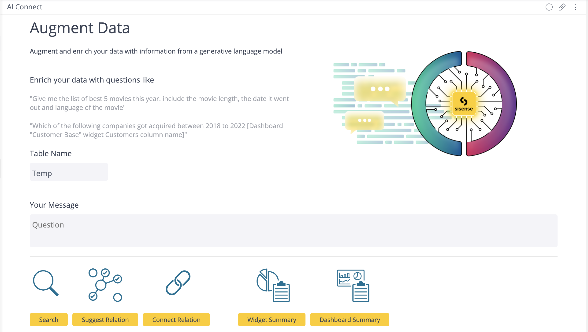
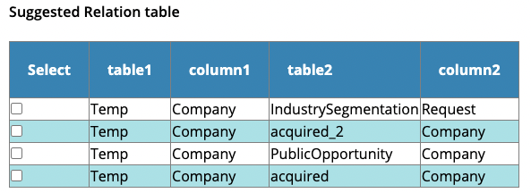

<a name="readme-top"></a>
[![LinkedIn][linkedin-shield]][linkedin-url]
[](https://www.sisense.com)


<!-- PROJECT LOGO -->
<br />
<div align="center">
  <a href="https://www.sisense.com">
    
  </a>
</div>
<br/>
<br/>

The following examples show how language models can be integreated into Sisense from a UI-friendly perspective. We leverage [Blox][Blox-url] and [Custom Code Transformation][Custom-Code] to show a number of examples how language models can be used to enrich your data or improve your analytics. 

<br/>
<!-- TABLE OF CONTENTS -->
<details open="open">
  <summary>Table of Contents</summary>
  <ol>
    <li>
      <a href="#about-the-project">About The Project</a>
      <ul>
        <li><a href="#built-with">Built With</a></li>
      </ul>
    </li>
    <li>
      <a href="#getting-started">Getting Started</a>
      <ul>
        <li><a href="#prerequisites">Prerequisites</a></li>
        <li><a href="#installation">Installation</a></li>
      </ul>
    </li>
    <li><a href="#usage">Usage</a>
    <ul>
        <li><a href="#search-notebook">Search</a></li>
        <li><a href="#suggest-relation">Suggest Relation</a></li>
        <li><a href="#connect-relation">Connect Relation</a></li>
        <li><a href="#widget-summary">Widget Summary</a></li>
        <li><a href="#dashboard-summary">Dashboard Summary</a></li>
      </ul>
    </li>
  </ol>
</details>
<br/>
<br/>


<!-- ABOUT THE PROJECT -->
## About The Project




<p align="right">(<a href="#readme-top">back to top</a>)</p>


### Built With


* Sisense API      <a href="https://sisense.dev/guides/rest/"></a> 
* Python [![Python][Python.com]][Python-url]
* Sisense Blox     <a href="https://www.sisense.com/marketplace/blox-widgets/"></a>
* Sisense Custom Code Transformations     <a href="https://docs.sisense.com/main/SisenseLinux/transforming-query-results-with-python.htm"></a> 


<p align="right">(<a href="#readme-top">back to top</a>)</p>


<!-- GETTING STARTED -->
## Getting Started


### Prerequisites

* An active Sisense account with a live model on Snowflake. No need to have a write permission on Snowflake read will be good enough.
[How to add a model](https://dtdocs.sisense.com/article/managing-data).
* [OpenAI API key](https://openai.com/blog/openai-api/)


### Installation


1. Log in to your Sisense instance (as a "Data Admin" or above)
2. Enable Blox from the Admin/Add-Ons page:

3. Enable Custom Code and Custom Transformation:

4. Open **any** widget in edit mode
5. Click on the menu items and click the “Add Transformation”:

6. Select "Import Notebook"
7. Drag or select the [installation notebook](../InstallBloxAI.sipynb) to the import screen
8. Insert 'Install' in operation section, and your OpenAI API key in AIAPIKEY section:

   Important Note: The same notebook performs both Install and Uninstall operations - verify the required operation was selected
9. That’s it! you did it! 
If you refresh the analytics page you should see a new dashboard: _“Blox AI”_


<p align="right">(<a href="#readme-top">back to top</a>)</p>


<!-- USAGE EXAMPLES -->
# Usage
We provide 5 examples of using a language model within Sisense:

1. **Search**: Enrich your data
1. **Suggest Relation**: Suggest relationships between tables
1. **Connect Relation**: Connect relationships between tables (based on the suggestions)
1. **Widget Summary**: Return a short summary based on the  data of a single widget in a dashboard
1. **Dashboard Summary**: Return a short summary based on the data from all widgets in a dashboard  
    
For a full review, please see the custom_code_notebooks section
    

## **Search**  <a name="search-notebook"></a>
Search is used to enrich your data by prompting the language model and integrating the results back into Sisense. The results are presented as a widget in the dashboard as well and being stored in a new table.  

***The search result will be stored in a Snowflake table***
* Edit the `Table Name` field and enter the name of the table that will hold the result
* Write your prompt under `Your Message`, for example:
```
Please provide industry segmentation for each of the following companies: [dashboard: opportunity widget: customers column: company]
```
* Click on `Search`
* A widget with the found results will be displayed


 
 
## **Suggest Relation**
Use the AI model to search the correct join relation between the new generated table and the existing tables
* Edit the `Table Name` field and enter the name of the table should be connected
* Click on `Suggest Relation`
* A list of possible relations should be shown



## **Connect Relation**
This functionality should be used **after** using [Suggest Relation](#suggest-relation)
* Click the radio button on the desired suggested relations
* Click on `Connect Relation`
* Go to the data model (under `Data` tab), you should see the table is now connected using the selected relations

## **Widget Summary**
Generate a summary based on the data presented in the widget
Do one of the following:
1. Edit dashboard's data source and select the data source containing the target widget
1. Prefix the prompt of the next step with "model {Name of the data model that the target widget uses} {dashboard {Name of dashboard that contains the widget}"

* Edit the prompt with "widget {Target Widget Title}"
* Click on `Widget Summary`
## **Dashboard Summary**
Generate summary based on the data presented in all the widgets in the dashboard.

Do one of the following:
1. Edit dashboard's data source and select the data source containing the target dashboard
1. Prefix the prompt of the next step with "model {Name of the data model that the target dashboard uses}"

* Edit the prompt with "dashboard {Target Dashboard Title}"
* Click on `Dashboard Summary`
* A response containing a short summary should be displayed


<p align="right">(<a href="#readme-top">back to top</a>)</p>


<!-- MARKDOWN LINKS & IMAGES -->
<!-- https://www.markdownguide.org/basic-syntax/#reference-style-links -->
[contributors-shield]: https://img.shields.io/github/contributors/sisense/sisensejs-components?style=for-the-badge
[contributors-url]: https://github.com/orgs/sisense/people
[forks-shield]: https://img.shields.io/github/forks/othneildrew/Best-README-Template.svg?style=for-the-badge
[forks-url]: https://github.com/othneildrew/Best-README-Template/network/members
[stars-shield]: https://img.shields.io/github/stars/othneildrew/Best-README-Template.svg?style=for-the-badge
[stars-url]: https://github.com/othneildrew/Best-README-Template/stargazers
[issues-shield]: https://img.shields.io/github/issues/othneildrew/Best-README-Template.svg?style=for-the-badge
[issues-url]: https://github.com/othneildrew/Best-README-Template/issues
[license-shield]: https://img.shields.io/github/license/othneildrew/Best-README-Template.svg?style=for-the-badge
[license-url]: https://github.com/othneildrew/Best-README-Template/blob/master/LICENSE.txt
[linkedin-shield]: https://img.shields.io/badge/-LinkedIn-black.svg?style=for-the-badge&logo=linkedin&colorB=blue
[linkedin-url]: https://www.linkedin.com/company/sisense/


[Sisense.com]: https://www.sisense.com
[Python-url]: https://www.python.org/
[Python.com]: https://img.shields.io/badge/Python-0769AD?style=for-the-badge&logo=python&logoColor=white
[Blox-url]: https://www.sisense.com/marketplace/blox-widgets/
[Custom-Code]: https://docs.sisense.com/main/SisenseLinux/transforming-query-results-with-python.htm
