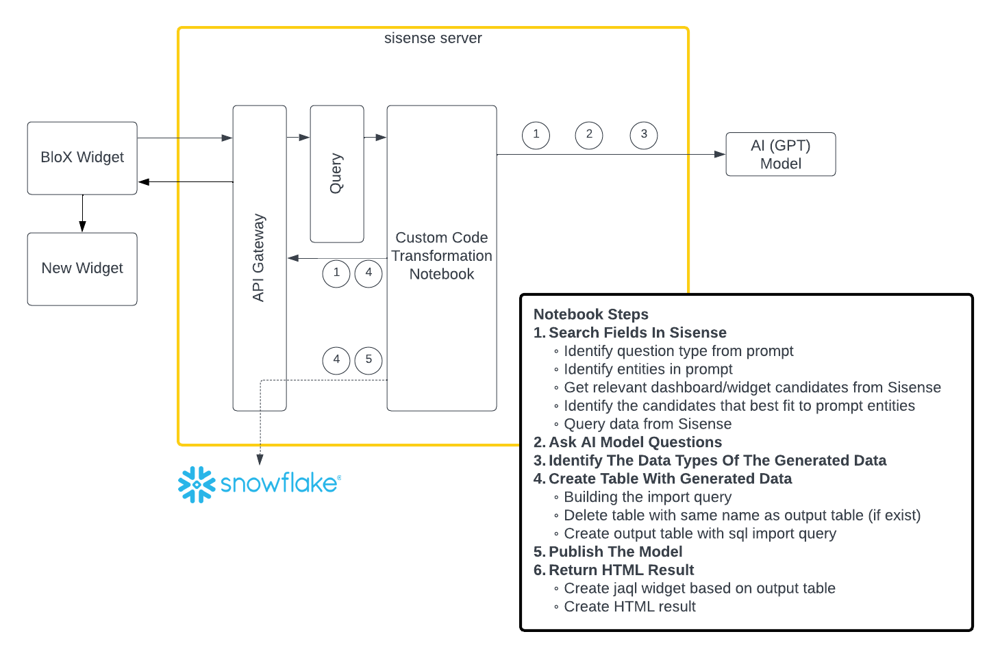
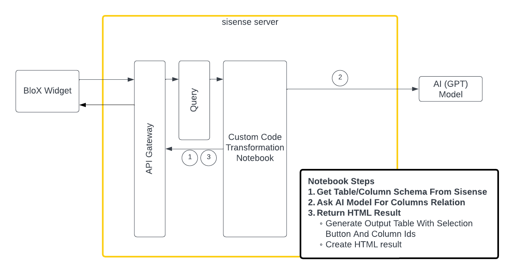
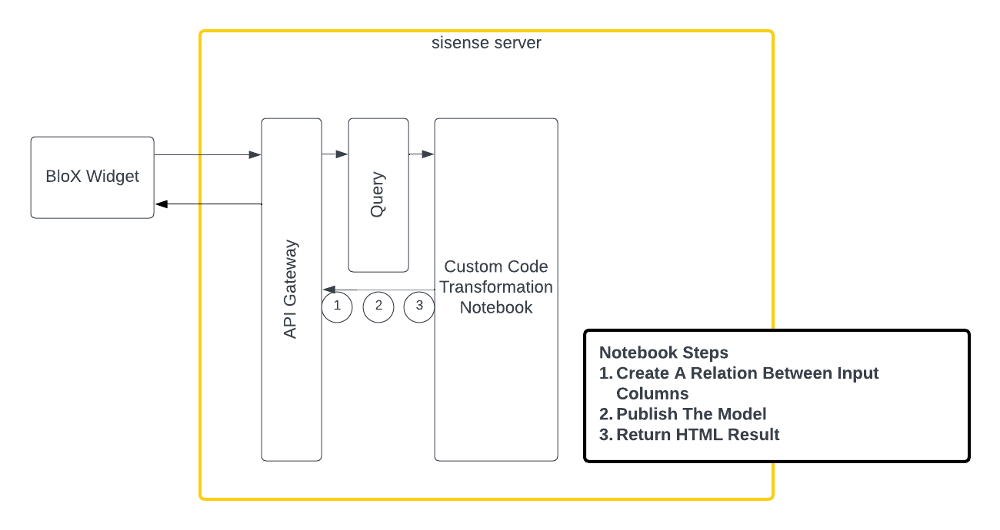
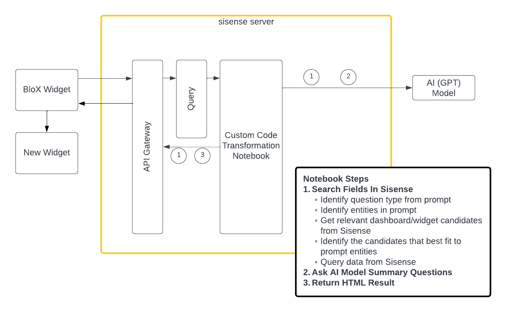
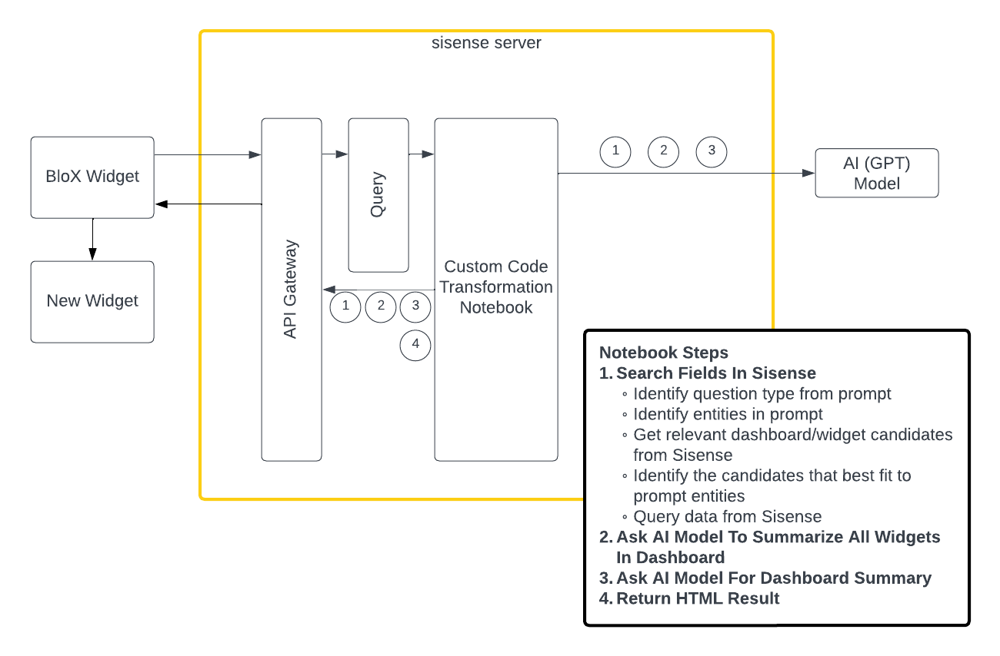

[![LinkedIn][linkedin-shield]][linkedin-url]

<!-- PROJECT LOGO -->
 

  

 
 

 
<!-- TABLE OF CONTENTS -->

  
Table of Contents

  1. [Source Code Overview](#Source Code Overview)
      1. [Folder Structure](#Folder Structure)
  1. [Caching Component](#Caching Component)
  1. [Usage](#Usage)
      1. [Example Usage](#Example Usage)
      1. [Detailed Use Case](#Detailed Use Case)
          1. [Search](#Search)
          1. [Suggest Relation](#Suggest Relation)
          1. [Connect Relation](#Connect Relation)
          1. [Widget Summary](#Widget Summary)
          1. [Dashboard Summary](#Dashboard Summary)

  
  
<!-- Source Code Overview -->
# Source Code Overview
Each folder in this repo (DashboardSummary1, WidgetSummary1, DataSearch1...) contain a notebook with the corresponding integration and a sipynb file that can be used to import the notebook into Sisense instance.
The utils libraries (AIIntegration.py, AIUtils.py, SisenseAPI.py..) are contain different functionalities that are shared between all the notebooks.
Each library has its own responsibilities and functionalities:
1. AIIntegration - manage GPT integration, contains different functionalities to parse, submit and process requests
2. AIUtils - manage Sisense API, holds Sisense connection object and responsible for all needed API calls. Responsible for different utilities that are shared
   between different notebooks (such as generate html output based on pandas dataframe). Also holds time logger and query logger, that holds the execution logs.
3. InferenceQuestionType - contain classes for Question type inference, each class represent different question type, which needs to be 
      inferred from the prompt generated by the user. Each class will extract the relevant entities from the prompt and will map the entities to Sisense elements.
      Also, each class will create the relevant jaql for the sisense elements.
4. AIQueries - manage the connection with OpenAI, use to submit requests and parse responses. 
5. SisenseAPI - manage Sisense API connection.
6. customcode_errors - manage custom code errors.

## Folder Structure :cactus: 

  
Folder Structure

    ├── custom_code_notebooks
    │   ├── DashboardSummary1
    │   │   ├──BloxAIFlows-SummarizeDashboard.png
    │   │   ├──DashboardSummary.sipynb                 ──> Custom Code Transformation example
    │   │   └──DashboardSummary1.ipynb                 ──> Custom Code Transformation import/export file
    │   │      
    │   ├── DataConnect1
    │   │   ├──BloxAIFlows-ConnectRelation.png
    │   │   ├──CreateRelations.sipynb                  ──> Custom Code Transformation example
    │   │   └──DataConnect1.ipynb                      ──> Custom Code Transformation import/export file
    │   │      
    │   ├── DataSearch1
    │   │   ├──BloxAIFlows-DataSearch.png
    │   │   ├──DataSearch.sipynb                       ──> Custom Code Transformation example
    │   │   └──DataSearch1.ipynb                       ──> Custom Code Transformation import/export file
    │   │      
    │   ├── DataSuggest1
    │   │   ├──BloxAIFlows-SuggestRelation.png
    │   │   ├──DataSuggest1.ipynb                      ──> Custom Code Transformation example
    │   │   └──SuggestRelation.sipynb                  ──> Custom Code Transformation import/export file
    │   │      
    │   ├── WidgetSummary1
    │   │   ├──BloxAIFlows-SummarizeWidget.png
    │   │   ├──WidgetSummary.sipynb                    ──> Custom Code Transformation example
    │   │   └──WidgetSummary1.ipynb                    ──> Custom Code Transformation import/export file
    │   │ 
    │   ├── utils
    │   │   ├── AIIntegration.py                       ──> manage the GPT integrations
    │   │   ├── AIQueries.py                           ──> manage the conenction with openAI 
    │   │   ├── SisenseAPI.py                          ──> Sisense API connection
    │   │   ├── customcode_errors.py                   ──> Python error codes 
    │   │   ├── AIUtils.py                             ──> utils and shared objects
    │   │   └── InferenceQuestionType.py               ──> Infer question type from the prompts
    │   │ 
    │   ├── __init__.py
    │   └── Readme.md

<!-- Caching Component -->
# Caching Component 

The caching component used to cache questions and responses from GPT - to speed the performance and efficiency.
The caches files are stored as files within the notebook's directory (DashboardSummary1, WidgetSummary1, DataSearch1...)  

The used caches:

1. **datatypes** - store questions (and responses) of data types inference.

2. **model_queries** - store questions (and responses) of entity extraction and validation (extract dashboard name from prompt question/ identify the relevant dashboard in Sisense).

3. **cachefile** - store questions (and responses) of data queries for search functionality.

4. **describe** - store questions (and responses) of data summary for dashboard and widget summary.

For each cache there are 3 files: *.dir, *.bak, *.dat. If you wish to delete the cache, delete the corresponding files.

<!-- USAGE -->
# Usage 
We provide 5 use cases:

1. **Search**: Enrich your data
1. **Suggest Relation**: Suggest relationships between tables
1. **Connect Relation**: Connect relationships between tables (based on the suggestions)
1. **Widget Summary**: Return a short summary based on the  data of a single widget in a dashboard
1. **Dashboard Summary**: Return a short summary based on the data from all widgets in a dashboard

<!-- Example-Usage -->
### Example Usage Overview 
The table below holds example questions the tasks implemented for Sisense integration with GPT:

Task | User Question Example                                                                                                              | Notebook name | Data source   | Writes data to a temp table | Result                                  |
------------ |------------------------------------------------------------------------------------------------------------------------------------|---------------|---------------|-----------------------------|-----------------------------------------
Get external data from GPT into Sisense | Give me the list of best 5 movies this year. include the movie length, the date it went out and language of the movie              | DataSearch           | external only | Yes | Create table with the generated data    | 
Enrich data from Sisense, with external data from GPT and populate into Sisense | Please provide industry segmentation for each of the following companies: [dashboard: opportunity widget: customers column: company] | DataSearch           | external and Sisense data | Yes   | Create table with the generated data    | 
Get recommendations for join relations between Target table and other tables in the data model from GPT | Target table name                                                                                                                  | DataSuggest  | Sisense data | No     | Output a Table with suggested relations | 
Create a relations between tables based on user selection (relation suggested as part of previous step) | columns IDs   | DataConnect  | Sisense data | No     | Create a relation in the data model     | 
Generate a short summary based on the data of a single widget in a dashboard | widget "acv" in dashboard "fortune summary"   | WidgetSummary  | Sisense data | No     | output a textual summary     | 
Generate a short summary based on the data from all widgets in a dashboard | model "sample ecommerce" dashboard "sample ecommerce"  | DashboardSummary  | Sisense data | No     | output a textual summary     | 

## Detailed Use Cases 

### Search 
Search is used to enrich your data by prompting the language model and integrating the results back into Sisense. The results are stored in a new table. (in a live Snowflake/Redshift model) 

if you wish to trigger this notebook via Sisense UI see [instructions](../../blox_usage/Readme.md#**Search**)

The notebook flow presented in the next diagram.

Sisense API calls for each step are presented in the next table.

Step Name | Sub Step Name                                            | Step description                                                                                                          | API calls                                                                                                                                                                                        |
------------ |----------------------------------------------------------|---------------------------------------------------------------------------------------------------------------------------|--------------------------------------------------------------------|
Search Fields In Sisense | Identify question type from prompt                       | Identify the type of the question, which determines which entities (for example, table name or dashboard name) to extract | GPT API                                                                                                                                                                                          |
Search Fields In Sisense | Identify entities in prompt                              | Extract the relevant entities (based on the question type) from the prompt                                                | GPT API                                                                                                                                                                                          |
Search Fields In Sisense | Get relevant dashboard/widget candidates from Sisense    | Extract Sisense elements (table name/ dashboard name)                                                                     | get all dashboards for a data model - `'GET', '/api/v1/dashboards?{"datasourceTitle": model_name}'` get tables schema in a data model -`'GET','/api/v2/datamodels/schema?{"title": model_name}'` |
Search Fields In Sisense | Identify the candidates that best fit to prompt entities | Map between Sisense elements to prompt entities                                                                           | GPT API                                                                                                                                                                                          |
Search Fields In Sisense | Query data from Sisense                                  | Build jaql and run it                                                                                                     | run jaql and extract data - `'POST', '/api/datasources/{cube_name}/jaql'`                                                                                                                        |
Ask AI Model Questions | -                                                        | Ask GPT the prompt question with Sisense Data in batch mode                                                               | GPT API                                                                                                                                                                                          |
Identify The Data Types Of The Generated Data | -                                                        | Identify the data type for the data generated by GPT (text/number/date)   | GPT API                                                                                                                                                                                          |
Create Table With Generated Data | Building the import query                                | Building query with generated data to insert the output table   | -                                                                                                                                                                                                |
Create Table With Generated Data | Delete table with same name as output table (if exist)   | Delete table   | delete table -  `‘DELETE', ‘/api/v2/datamodels/{datamodelId}/schema/datasets/{datasetId}/tables/{table_schema['oid']}’`                                                                          |
Create Table With Generated Data | Create output table with sql import query                | Create table with generated data   | create new table - `'POST', '/api/v2/datamodels/{datamodelId}/schema/datasets/{datasetId}/tables'`                                                                                               |
Publish The Model | -    | Publish data model   | publish model - `'POST' ,   '/api/v2/builds'`                                                                                                                                                    |
Return HTML Result | Create jaql widget based on output table    | Create jaql that will represent a widget with the result, with parameters from the output table   | -      |
Return HTML Result | Create HTML result    | Create HTML with result table, dynamic log table and steps timing table    | -      |
v

---

### Suggest Relation 

Use GPT to search the correct join relation between tables in your data model.

if you wish to trigger this notebook via Sisense UI see [instructions](../../blox_usage/Readme.md#**Suggest-Relation**)

The notebook flow presented in the next diagram.

Sisense API calls for each step are presented in the next table.

Step Name | Sub Step Name                                            | Step description                                                                                | API calls                                                                                                                                                                                        |
------------ |--------------------------|-------------------------------------------------------------------------------------------------|--------------------------------------------------------------------|
Get Table/Column Schema From Sisense | -                  | Extract Sisense elements (table schema)                                                         | get tables schema in a data model (and column names)- `'GET','/api/v2/datamodels/schema?{"title": model_name}'`                                                                                                                                                                                         |
Ask AI Model For Columns Relation | -           | Ask GPT to infer possible relation based on table schema                                        | GPT API                                                                                                                                                                                          |
Return HTML Result | Generate Output Table with selection button and column ids                | Create result table with the suggestion relations, contain the column ids in Sisense  | -      |
Return HTML Result | Create HTML result                                       | Create HTML with result table, dynamic log table and steps timing table                         | -      |

---

### Connect Relation 
This functionality used to connect columns that were suggested by [Suggest Relation](#suggest-relation).

if you wish to trigger this notebook via Sisense UI see [instructions](../../blox_usage/Readme.md#**Connect-Relation**)

The notebook flow presented in the next diagram.

Sisense API calls for each step are presented in the next table.

Step Name | Sub Step Name                                            | Step description                                                                                | API calls                                                                                                                                                                                        |
------------ |--------------------------|-----------------------------------------------|--------------------------------------------------------------------|
Create A Relation Between Input Columns | -                  | create a relation                | add relation between columns in model schema - `‘POST', '/api/v2/datamodels/{datamodelId}/schema/relations’`                                                                                                                                                                                     |
Publish The Model | -    | Publish data model   | publish model - `'POST' ,   '/api/v2/builds'`                                                                                                                                                    |
Return HTML Result | Create HTML result                                       | Create HTML with result table, dynamic log table and steps timing table                         | -      |

---

### Widget Summary 
Generate a summary based on the data presented in the widget.

if you wish to trigger this notebook via Sisense UI see [instructions](../../blox_usage/Readme.md#**Widget-Summary**)

The notebook flow presented in the next diagram.

Sisense API calls for each step are presented in the next table.

Step Name | Sub Step Name                                            | Step description                                                                                | API calls                                                                                                                                                                                        |
------------ |--------------------------|-----------------------------------------------|--------------------------------------------------------------------|
Search Fields In Sisense | Identify question type from prompt                       | Identify the type of the question, which determines which entities (for example, table name or dashboard name) to extract | GPT API                                                                                                                                                                                          |
Search Fields In Sisense | Identify entities in prompt                              | Extract the relevant entities (based on the question type) from the prompt                                                | GPT API                                                                                                                                                                                          |
Search Fields In Sisense | Get relevant dashboard/widget candidates from Sisense    | Extract Sisense elements (table name/ dashboard name)                                                                     | get all dashboards for a data model - `'GET', '/api/v1/dashboards?{"datasourceTitle": model_name}'` get all widgets in a dashboard - `'GET', '/api/v1/dashboards/{dashboard_oid}/widgets'`|
Search Fields In Sisense | Identify the candidates that best fit to prompt entities | Map between Sisense elements to prompt entities                                                                           | GPT API                                                                                                                                                                                          |
Search Fields In Sisense | Query data from Sisense                                  | Build jaql and run it                                                                                                     | run jaql and extract data - `'POST', '/api/datasources/{cube_name}/jaql'`                                                                                                                        |
Ask AI Model Summary Questions | -              | Ask AI Model to summarize the data in the widget                | GPT API                                                            |
Return HTML Result | Create HTML result                                       | Create HTML with widget summary, dynamic log table and steps timing table                       | -      |

---

### Dashboard Summary 
Generate summary based on the data presented in all the widgets in the dashboard.

if you wish to trigger this notebook via Sisense UI see [instructions](../../blox_usage/Readme.md#**Dashboard-Summary**)

The notebook flow presented in the next diagram.

Sisense API calls for each step are presented in the next table.

Step Name | Sub Step Name                                            | Step description                                                                                                          | API calls                                                                                                                                                                                        |
------------ |--------------------------|---------------------------------------------------------------------------------------------------------------------------|--------------------------------------------------------------------|
Search Fields In Sisense | Identify question type from prompt                       | Identify the type of the question, which determines which entities (for example, table name or dashboard name) to extract | GPT API                                                                                                                                                                                          |
Search Fields In Sisense | Identify entities in prompt                              | Extract the relevant entities (based on the question type) from the prompt                                                | GPT API                                                                                                                                                                                          |
Search Fields In Sisense | Get relevant dashboard/widget candidates from Sisense    | Extract Sisense elements (table name/ dashboard name)                                                                     | get all dashboards for a data model - `'GET', '/api/v1/dashboards?{"datasourceTitle": model_name}'` get all widgets in a dashboard - `'GET', '/api/v1/dashboards/{dashboard_oid}/widgets'`|
Search Fields In Sisense | Identify the candidates that best fit to prompt entities | Map between Sisense elements to prompt entities                                                                           | GPT API                                                                                                                                                                                          |
Search Fields In Sisense | Query data from Sisense                                  | Build jaql and run it                                                                                                     | run jaql and extract data - `'POST', '/api/datasources/{cube_name}/jaql'`                                                                                                                        |
Ask AI Model To Summarize All Widgets In Dashboard | -                                                        | Ask GPT to summarize (separately) each widget in the dashboard                                                            | GPT API                                                            |
Ask AI Model For Dashboard Summary | -                                                        | Ask AI Model to summarize all widget summaries into a single one                | GPT API                                                            |
Return HTML Result | Create HTML result                                       | Create HTML with dashboard summary, dynamic log table and steps timing table                                        | -      |

(<a href="#readme-top">back to top</a>)

<!-- MARKDOWN LINKS & IMAGES -->
<!-- https://www.markdownguide.org/basic-syntax/#reference-style-links -->
[contributors-shield]: https://img.shields.io/github/contributors/sisense/sisensejs-components?style=for-the-badge
[contributors-url]: https://github.com/orgs/sisense/people
[forks-shield]: https://img.shields.io/github/forks/othneildrew/Best-README-Template.svg?style=for-the-badge
[forks-url]: https://github.com/othneildrew/Best-README-Template/network/members
[stars-shield]: https://img.shields.io/github/stars/othneildrew/Best-README-Template.svg?style=for-the-badge
[stars-url]: https://github.com/othneildrew/Best-README-Template/stargazers
[issues-shield]: https://img.shields.io/github/issues/othneildrew/Best-README-Template.svg?style=for-the-badge
[issues-url]: https://github.com/othneildrew/Best-README-Template/issues
[license-shield]: https://img.shields.io/github/license/othneildrew/Best-README-Template.svg?style=for-the-badge
[license-url]: https://github.com/othneildrew/Best-README-Template/blob/master/LICENSE.txt
[linkedin-shield]: https://img.shields.io/badge/-LinkedIn-black.svg?style=for-the-badge&logo=linkedin&colorB=blue
[linkedin-url]: https://www.linkedin.com/company/sisense/

[Sisense.com]: https://www.sisense.com
[Python-url]: https://www.python.org/
[Python.com]: https://img.shields.io/badge/Python-0769AD?style=for-the-badge&logo=python&logoColor=white
[Blox-url]: https://www.sisense.com/marketplace/blox-widgets/
[Custom-Code]: https://docs.sisense.com/main/SisenseLinux/transforming-query-results-with-python.htm
